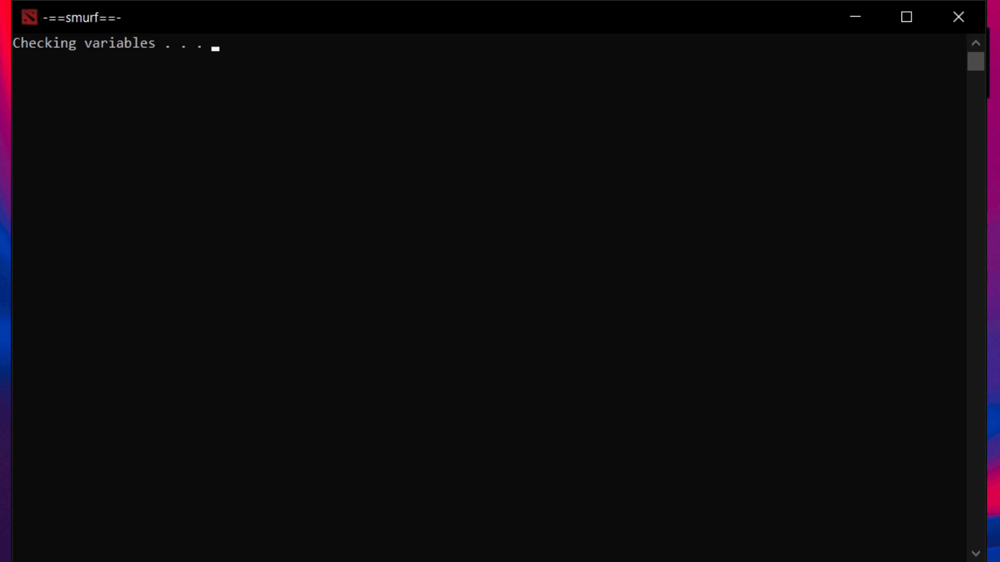

# Steam Smurf

Do you have a _"smurf"_ account? Does the whole process of 
logging off, waiting, copy-pasting/remembering
login information, logging in, waiting and so on bother you?  

You don't have to go through that.

> :warning: Although chances are low, it is your responsibility if a precious account gets stolen  
> This script [stores your information as plain text](https://www.passcamp.com/blog/dangers-of-storing-and-sharing-passwords-in-plaintext/)



## How it works

1. Validates provided information, asks for input if needed
2. Shuts down currently running Steam process 
3. Logs in and launches game with provided info  
   &nbsp;&nbsp;&nbsp;&nbsp;&nbsp;_optionally_ ↴
4. Waits for game to exit _with a hidden window_
5. Restarts Steam

> :information_source: The optional part only works if the `game` variable is
> provided, you can find a game's path easily in Task Manager 
> by right clicking the game's process, and selecting _Open file location_ 

## Download & Setup

[:arrow_double_down:Download smurf.bat](https://github.com/FLevent29/steam-smurf/releases/download/1.1/smurf.bat)

#### _Information_ the script needs :

- **Username**
- **Password**
- **Steam folder path** (if not default)
- **Game's Steam ID** (:bulb: leave this empty)
- **Game's executable path** (optional)

> :information_source: All of these can be entered manually, by
> **editing** the script with a preferred **text editor** like notepad  
> - if the `game` variable is wrong, it can only be corrected like so  
> - if you wish to change anything, it can only be done like so
> (at the very least by emptying the variables)
> 
> :information_source: To get `id` you could just leave it empty,
> the script finds all the available ones, leaving you to
> simply select from them . .  
> Otherwise it's right next to `store.steampowered.com/app/` 
> on the [game's store page](https://store.steampowered.com/)

Example of how the script should look like for Dota2 ↴

```bat
set "username=anonym"
set "password=mynona"

set "steamFolder=%ProgramFiles(x86)%\Steam"

set "id=570"

set "game=%steamFolder%\steamapps\common\dota 2 beta\game\bin\win64\dota2.exe"
```

:bulb: On Windows 10 you could set up a _shortcut_ to the
script in `%appdata%\Microsoft\Windows\Start Menu\Programs` . .  
This way you can quickly launch it by pressing
<kbd>Win</kbd> and typing in the shortcuts' name,
also you can set an icon . .